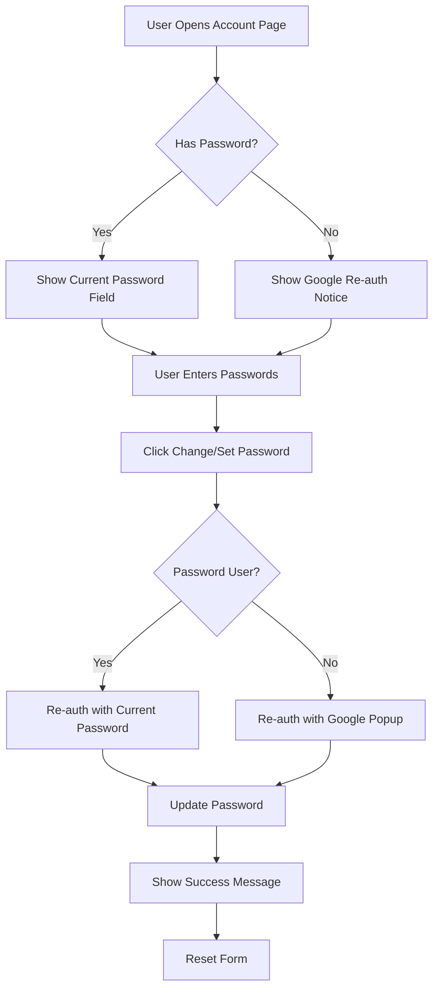

# Hướng Dẫn Đổi Password - Account Settings

## 📋 Tổng Quan

Tính năng **Account Settings** cho phép admin users quản lý thông tin tài khoản và thay đổi password một cách an toàn.

## 🎯 Tính Năng

### 1. **Xem Thông Tin Tài Khoản**
- Email address
- Authentication methods (Email/Password, Google)
- User ID (UID)

### 2. **Đổi Password**
- Đổi password cho users đã có password
- Set password mới cho Google users
- Validation mạnh mẽ (minimum 8 characters)
- Re-authentication để đảm bảo bảo mật

### 3. **Security Tips**
- Best practices cho password security
- Hướng dẫn tạo password mạnh

## 🔐 Quy Trình Đổi Password

### Cho Email/Password Users:

1. Đăng nhập vào Admin Dashboard
2. Vào **Settings > Account** (hoặc `/admin/account`)
3. Scroll xuống **Change Password** section
4. Nhập:
   - **Current Password**: Mật khẩu hiện tại
   - **New Password**: Mật khẩu mới (tối thiểu 8 ký tự)
   - **Confirm New Password**: Xác nhận mật khẩu mới
5. Click **Change Password**
6. Hệ thống sẽ:
   - Re-authenticate với current password
   - Update password mới
   - Hiển thị thông báo thành công

### Cho Google Users:

1. Đăng nhập vào Admin Dashboard
2. Vào **Settings > Account**
3. Scroll xuống **Change Password** section
4. Nhập:
   - **New Password**: Mật khẩu mới (tối thiểu 8 ký tự)
   - **Confirm New Password**: Xác nhận mật khẩu mới
5. Click **Set Password**
6. Hệ thống sẽ:
   - Hiển thị Google popup để re-authenticate
   - Set password mới sau khi verify
   - Cho phép login bằng email/password trong tương lai

## 📱 Mobile Responsive

Trang Account Settings đã được tối ưu cho mobile:
- Responsive layout với Tailwind breakpoints (`sm:`, `md:`)
- Form fields stack vertically trên mobile
- Buttons full-width trên mobile, auto-width trên desktop
- Text wrapping cho long email/UID
- Touch-friendly spacing

## 🛡️ Security Features

### Re-Authentication
- **Email/Password users**: Phải nhập current password
- **Google users**: Phải re-authenticate qua Google popup
- Tuân thủ Firebase Security best practices

### Validation
- Password minimum 8 characters
- Confirm password phải match
- Real-time error feedback
- Clear error messages

### Error Handling
| Error Code | User Message |
|------------|--------------|
| `auth/wrong-password` | Current password is incorrect |
| `auth/weak-password` | Password is too weak |
| `auth/requires-recent-login` | Please log out and log in again |
| `auth/popup-closed-by-user` | Authentication popup was closed |

## 🚀 Cách Truy Cập

### From Sidebar Navigation:
1. Mở Admin Dashboard
2. Trong sidebar, tìm **Settings** section
3. Click **Account** (icon: UserCircle)

### Direct URL:
```
https://your-domain.com/admin/account
```

## 📝 Default Admin Credentials

### Admin User 1:
- **Email**: `huutu289@gmail.com`
- **Password**: `huutu289@gmail.com`

### Admin User 2:
- **Email**: `iposntmk@gmail.com`
- **Password**: `iposntmk@gmail.com`

> ⚠️ **QUAN TRỌNG**: Đổi passwords này ngay sau lần đăng nhập đầu tiên!

## 🔧 Technical Details

### Files Created/Modified:

1. **`/src/app/admin/account/page.tsx`** (NEW)
   - Account settings page component
   - Password change form with validation
   - Account information display
   - Mobile-responsive layout

2. **`/src/components/admin/admin-sidebar.tsx`** (MODIFIED)
   - Added "Account" menu item
   - Icon: `UserCircle`
   - Position: First item in Settings section

3. **`/scripts/set-admin-passwords.js`** (NEW)
   - Script to set passwords for admin users
   - Can be re-run anytime: `node scripts/set-admin-passwords.js`

### Dependencies:
- `react-hook-form` - Form handling
- `zod` - Schema validation
- `@hookform/resolvers/zod` - Form validation resolver
- `firebase/auth` - Password change functionality

### Firebase Auth Methods Used:
- `updatePassword()` - Update user password
- `reauthenticateWithCredential()` - Re-auth for email/password users
- `reauthenticateWithPopup()` - Re-auth for Google users
- `EmailAuthProvider.credential()` - Create credential for re-auth

## 📊 Password Requirements

- **Minimum length**: 8 characters
- **Recommended**: 12+ characters
- **Best practice**:
  - Mix of uppercase and lowercase
  - Include numbers
  - Include symbols
  - Don't reuse passwords from other sites

## 🎨 UI Components

### Cards:
1. **Account Information**
   - Read-only display
   - Email, Auth methods, UID

2. **Change Password**
   - Password change form
   - Real-time validation
   - Success/error alerts

3. **Security Tips**
   - Password best practices
   - Security recommendations

### Alerts:
- **Success**: Green border with CheckCircle icon
- **Info**: Blue border with AlertCircle icon
- **Error**: Red border with error details

## 🐛 Troubleshooting

### "Current password is incorrect"
- Kiểm tra lại current password
- Đảm bảo Caps Lock không bật
- Thử reset password qua email nếu quên

### "Please log out and log in again"
- Session đã expire
- Đăng xuất và đăng nhập lại
- Thử đổi password ngay sau khi login

### "Authentication popup was closed"
- Chỉ xảy ra với Google users
- Click "Set Password" lại
- Hoàn tất Google authentication popup

### "Password is too weak"
- Password phải ít nhất 8 ký tự
- Thêm uppercase, numbers, symbols
- Sử dụng password generator nếu cần

## 📸 Screenshots

### Desktop View:
```
┌─────────────────────────────────────────┐
│ Account Settings                        │
├─────────────────────────────────────────┤
│ [Account Information Card]              │
│ - Email: admin@example.com              │
│ - Methods: [Email/Password] [Google]    │
│ - UID: ABC123...                        │
├─────────────────────────────────────────┤
│ [Change Password Card]                  │
│ Current Password: [_____________]       │
│ New Password:     [_____________]       │
│ Confirm Password: [_____________]       │
│                   [Cancel] [Change]     │
├─────────────────────────────────────────┤
│ [Security Tips Card]                    │
│ • Use unique password                   │
│ • 12+ characters recommended            │
└─────────────────────────────────────────┘
```

### Mobile View:
```
┌───────────────────┐
│ Account Settings  │
├───────────────────┤
│ [Account Info]    │
│ Email:            │
│ admin@example.com │
│                   │
│ Methods:          │
│ [Email/Password]  │
│ [Google]          │
├───────────────────┤
│ [Change Password] │
│ Current:          │
│ [___________]     │
│                   │
│ New:              │
│ [___________]     │
│                   │
│ Confirm:          │
│ [___________]     │
│                   │
│ [Cancel (full)]   │
│ [Change (full)]   │
└───────────────────┘
```

## 🔄 Password Change Flow



## 📚 Related Documentation

- [Firebase Authentication](https://firebase.google.com/docs/auth)
- [Next.js App Router](https://nextjs.org/docs/app)
- [React Hook Form](https://react-hook-form.com/)
- [Zod Validation](https://zod.dev/)

## ✅ Testing Checklist

- [ ] Email/Password user can change password
- [ ] Google user can set password
- [ ] Current password validation works
- [ ] Password match validation works
- [ ] Error messages display correctly
- [ ] Success message shows after change
- [ ] Form resets after successful change
- [ ] Re-authentication works for both providers
- [ ] Mobile responsive layout works
- [ ] Sidebar navigation link works
- [ ] Direct URL access works

## 🎉 Summary

Tính năng Account Settings đã được triển khai hoàn chỉnh với:
- ✅ Password change functionality
- ✅ Google & Email/Password support
- ✅ Secure re-authentication
- ✅ Mobile responsive design
- ✅ User-friendly error handling
- ✅ Clear security tips
- ✅ Admin sidebar integration

Users có thể đổi password dễ dàng và an toàn ngay trong admin dashboard!
